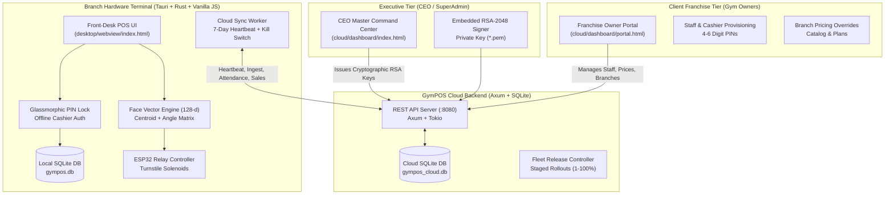
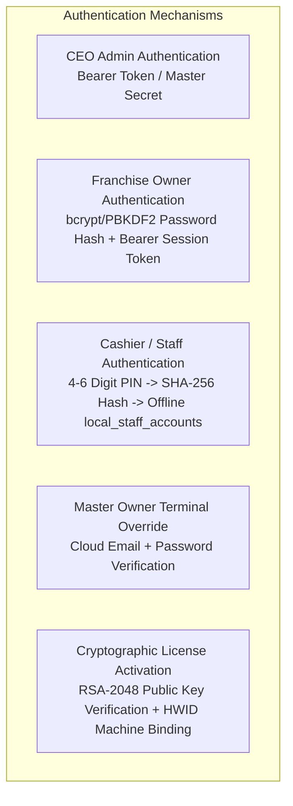
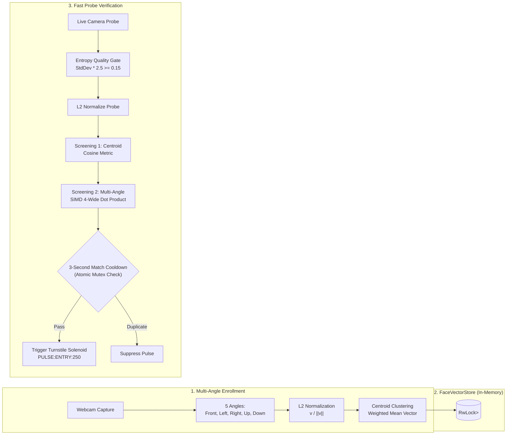
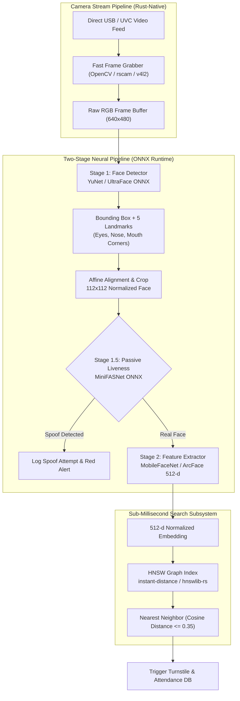

# GymPOS SaaS: Master System Architecture, AAA Framework & Engineering Roadmap for Claude

> **Target Audience:** Engineering Hand-off Document for Claude (and AI Agent Collaborators)  
> **Repository:** `gympos-saas`  
> **Last Verified Git Commit:** `753fd2c` (Branch: `main`)  
> **Status:** Production-Ready Core POS + Cloud Bridge + Centralized CEO License Hierarchy  

---

## Table of Contents
1. [System Architecture Overview](#1-system-architecture-overview)
2. [Complete Feature Inventory](#2-complete-feature-inventory)
3. [AAA Framework Breakdown (Authentication, Authorization, Accounting)](#3-aaa-framework-breakdown)
4. [Biometrics Subsystem: Current Implementation Audit](#4-biometrics-subsystem-current-implementation-audit)
5. [Engineering Blueprint for Claude: Enhancing Face Embedding & Face Scanning](#5-engineering-blueprint-for-claude-enhancing-face-embedding--face-scanning)
6. [Data Schemas & Synchronization Protocol](#6-data-schemas--synchronization-protocol)
7. [Verification Suite & Diagnostic Tooling](#7-verification-suite--diagnostic-tooling)

---

## 1. System Architecture Overview

GymPOS SaaS is a hybrid enterprise platform designed for fitness franchises operating physical turnstiles, point-of-sale registers, and multi-branch gym facilities:



### Architectural Tenets
1. **Zero-Trust Offline Independence**: Local POS terminals run turnstile biometrics, sales, and attendance completely offline without internet connectivity. If disconnected, local operations buffer in SQLite.
2. **Centralized CEO License Distribution**: Franchise gym owners cannot self-sign licenses. Only the CEO Master Command Center can sign and issue RSA-2048 keys.
3. **Cryptographic Branch Scoping**: Each issued license token encapsulates the branch UUID (`gym_id`). A key issued to Branch 1 cannot activate Branch 2.
4. **Hierarchical RBAC**: Staff credentials belong to a franchise owner and are filtered to specific branches. Front-desk staff only unlock cashier operations; business revenues and hardware calibrations remain locked.

---

## 2. Complete Feature Inventory

### 2.1 Centralized CEO Master Command Center (`cloud/dashboard/index.html`)
- **Collapsible Franchise Hierarchy**:
  - Replaces flat fleet tables with an interactive accordion grouped by Franchise Owner Account (`cloud_owner_accounts`).
  - Displays Company Name, Owner Email, Registration Timestamp, Total Branch Count, and License Badges (`All Licensed` vs `N Needs Key`).
  - Expanding an owner displays their branch drawer showing Location Names, Gym UUIDs, Tiers, Hardware Terminal IDs, and Action Controls.
- **CEO-Only License Issuance (`/api/v1/admin/branches/:gym_id/issue-key`)**:
  - Cryptographically signs an RSA-2048 license token bound strictly to that branch's UUID.
  - Generates token string: `GPOS-<base64_claims>.<base64_rsa_signature>`.
- **Direct Provisioning (`/api/v1/admin/owners/:email/branches`)**:
  - CEO can add a branch location directly under any franchise owner (with optional automatic key generation).
- **Remote Kill Switch (`/api/v1/remote/disable`)**:
  - Remotely locks out any compromised terminal or delinquent franchise. Polled by desktop sync.
- **Fleet Release & Auto-Updater Controller (`/api/v1/releases`)**:
  - Distributes versioned releases with cryptographic SHA-256 hashes, release notes, channel targeting (`stable`, `beta`, `nightly`), and staged rollout percentages (1–100%).

### 2.2 Franchise Owner Bridge Dashboard (`cloud/dashboard/portal.html`)
- **Self-Service Owner Registration**:
  - "Sign In" vs "Register New Owner" modal tab switcher. Allows new clients to onboard without manual database seeding.
- **Multi-Branch Terminal Management**:
  - Owners can request/register new branch locations. Newly created branches are flagged as `pending_license` awaiting CEO key issuance.
  - Branches with keys display an `Active (Licensed)` badge and a `[Copy Key]` button for the desktop terminal.
- **Staff & Cashier Management**:
  - Owners create staff profiles with 4-6 digit numeric PINs and assign them either to specific branches or as roaming accounts.
- **Branch-Exclusive POS Pricing Overrides**:
  - Owners can set branch-specific price overrides for products and memberships without altering other branches.
- **Consolidated Financial Telemetry**:
  - Aggregates daily gross sales, enrolled member count, active face vectors, turnstile check-in volume, and 30-day revenue charts. Filterable by branch or consolidated across the entire franchise.

### 2.3 Desktop Terminal POS & Turnstile Kiosk (`desktop/`)
- **Glassmorphic PIN Lock Screen (`#terminal-lock-screen`)**:
  - Protects the terminal UI with an on-screen numeric keypad and hardware keyboard support.
  - Cashier logins unlock POS selling, member attendance, and turnstile monitoring. Administrative views (revenue graphs, license vault, COM port relay calibration) are hidden.
- **Master Owner Local Override Modal**:
  - Allows the franchise owner to log in directly on the physical terminal using their cloud credentials to unlock administrative privileges.
- **3-Camera Multi-View Viewfinder Matrix**:
  - Camera 1: Entry Face Scanner.
  - Camera 2: Exit Face Scanner.
  - Camera 3: Overhead Anti-Tailgating ROI Radar.
- **Biometric Face Recognition Engine (`desktop/src-tauri/src/face.rs`)**:
  - 128-dimensional vector memory store with centroid clustering, multi-angle anchor matching, and cosine similarity.
- **ESP32 Serial Turnstile Relay Control (`desktop/src-tauri/src/hardware.rs`)**:
  - Direct hardware pulsing (`PULSE:ENTRY:250\n`) to unlock physical solenoids and turnstile barriers.
- **Walk-in 8-Hour Temporary Biometrics**:
  - Cashiers issue temporary day passes with face capture. Passes automatically expire after 8 hours.

---

## 3. AAA Framework Breakdown

### 3.1 Authentication (AuthN)



1. **CEO Admin Authentication**:
   - Master Secret: `gympos_master_ceo_secret_2026`.
   - Verified on all `/api/v1/admin/*`, `/api/v1/licenses/*`, `/api/v1/gyms/*`, and `/api/v1/remote/*` endpoints via `Authorization: Bearer <key>`.
2. **Franchise Owner Authentication**:
   - Managed in `cloud_owner_accounts` (`owner_email`, `password_hash`, `company_name`).
   - Authenticated on `/api/v1/owner/auth/login` and `/api/v1/owner/auth/register`.
   - Returns Bearer session token: `owner:<email>`.
3. **Front-Desk Cashier / Staff PIN Authentication**:
   - 4-6 digit numeric PIN entered via on-screen keypad.
   - Hashed locally using SHA-256 (`pin_hash`).
   - Matched against `local_staff_accounts` in desktop SQLite.
   - Branch Isolation: The cloud heartbeat filters staff syncing:
     ```sql
     SELECT id, owner_email, gym_id, full_name, username, pin_hash, role
     FROM cloud_staff_accounts
     WHERE owner_email = ?1 AND (gym_id = ?2 OR gym_id IS NULL)
     ```
     *Result:* Staff assigned to Branch 1 cannot unlock terminals at Branch 2.
4. **Terminal Master Owner Override**:
   - If an owner visits a branch terminal, they can click "Owner Login Override" to enter their cloud credentials.
   - Successful auth unlocks Manager/Owner privileges on that terminal session.
5. **Cryptographic Terminal License Authentication**:
   - Every terminal stores an active license token in `local_license_cache`.
   - Decoded and verified using the embedded 2048-bit RSA public key:
     - Form: `GPOS-<base64_claims>.<base64_signature>`
     - PKCS#1 v1.5 / PSS signature verification over SHA-256 hash of claims.
     - HWID Binding: Compares `claims.hwid` against the local Windows hardware fingerprint (`MachineGuid` + Disk Serial + Physical MAC + Hostname).

---

### 3.2 Authorization (AuthZ) & RBAC Matrix

| Role | Scope | POS Register | Attendance & Scans | Daily Reports | Financial Analytics | License Key Vault | Hardware Calibration | Add/Edit Staff |
| :--- | :--- | :---: | :---: | :---: | :---: | :---: | :---: | :---: |
| **CEO SuperAdmin** | Global Fleet | — | — | Full Fleet | Full Fleet | Full (Sign/Revoke) | Global Overrides | Full Fleet |
| **Franchise Owner** | All Owned Branches | — | Synced Logs | Franchise-wide | Franchise-wide | View/Copy (No Sign) | — | Full for Franchise |
| **Branch Manager** | Assigned Branch | ✅ | ✅ | Branch-only | Branch-only | View-only | Read-only | Local Only |
| **Cashier / Staff** | Assigned Branch | ✅ | ✅ | Shift-only | ❌ (Masked) | ❌ (Hidden) | ❌ (Locked) | ❌ |

---

### 3.3 Accounting (Auditing & Telemetry)

1. **Turnstile Attendance Logs (`cloud_attendance` & `local_attendance`)**:
   - Logged per check-in/check-out with `member_id`, `gym_id`, `direction` (IN/OUT), `method` (FACE / RFID / MANUAL), `confidence_score`, and UTC `timestamp`.
2. **POS Sales Transactions (`cloud_sales` & `local_sales`)**:
   - Stores line items, itemized subtotals, tax, discount, total amount, payment method (`CASH`, `GCASH`, `CARD`), cashier username, and terminal HWID.
3. **Audit Trails (`cloud_audit_logs`)**:
   - Tracks security-sensitive events: `gym_register`, `admin_create_branch`, `admin_issue_branch_key`, `license_revocation`, `kill_switch_toggle`, `staff_created`, and `catalog_override`.
4. **Heartbeat & Telemetry Tracking (`cloud_gyms` & `cloud_licenses`)**:
   - Desktop sync worker pushes local metrics every 5 seconds.
   - Cloud tracks `last_heartbeat_at`, total registered face profiles, and transaction volume.
   - 7-Day Grace Window: Terminals run offline up to 7 consecutive days before locking out if unable to contact the cloud.

---

## 4. Biometrics Subsystem: Current Implementation Audit

The current biometrics implementation resides in [`desktop/src-tauri/src/face.rs`](file:///c:/Users/USER/OneDrive/Desktop/Solo%20Lvel/gympos-saas/desktop/src-tauri/src/face.rs):



### Current Strengths
1. **Centroid Pre-screening**: Rather than comparing against all 5 angles for all $N$ members ($5N$ comparisons), the engine first compares against a single representative centroid vector, discarding non-matching candidates early.
2. **4-Wide Unrolled Dot Product**: `cosine_similarity_fast` breaks the loop into 4-float parallel accumulators (`acc0`, `acc1`, `acc2`, `acc3`), optimizing vector math for 128-d embeddings.
3. **Probe Quality Gating**: `calculate_vector_quality` computes the variance/standard deviation across embedding values. Flat embeddings (often caused by dark frames or occlusion) are rejected before cosine search.
4. **Continuous Learning (EMA Adaptation)**: When a member successfully authenticates with high confidence, `adapt_profile` updates their centroid using Exponential Moving Average:
   $$\mathbf{c}_{\text{new}} = \text{L2\_Norm}\left((1 - \alpha)\mathbf{c}_{\text{old}} + \alpha \mathbf{p}_{\text{live}}\right)$$
5. **Atomic Cooldown Mutex**: An atomic `LastMatchRecord` guards against double-pulsing turnstile relays when a member lingers in front of the camera.

### Current Limitations & Technical Debt
1. **Simulation-Driven Probe Vector Generation**: The webview camera viewfinder currently sends simulated/mocked 128-d vectors via IPC to Tauri, rather than running a neural net inference model directly on the raw video frames.
2. **Linear $O(N)$ Scanning**: As membership scales beyond 2,000 members per gym branch, the linear traversal across memory entries will begin to incur frame drops.
3. **Absence of 2D/3D Anti-Spoofing (Liveness)**: A printed photo or phone screen displaying a member's face can fool an embedding matcher if facial liveness is not evaluated.
4. **Webview/IPC Bandwidth Overhead**: Passing base64 images or large vector arrays across Tauri's webview IPC bridge introduces latency compared to in-process Rust pipeline processing.

---

## 5. Engineering Blueprint for Claude: Enhancing Face Embedding & Face Scanning

This section outlines the exact steps and architecture Claude should follow to elevate the biometric scanning engine to production-grade quality.



---

### Task 5.1: Embedded ONNX Runtime Engine in Tauri (`desktop/src-tauri`)

**Goal**: Run neural network models directly inside Rust using ONNX Runtime with CPU DirectML / OpenVINO / TensorRT acceleration.

1. **Add Dependencies in `desktop/src-tauri/Cargo.toml`**:
   ```toml
   [dependencies]
   ort = { version = "2.0.0-rc.4", features = ["directml", "copy-dylibs"] } # DirectML for Windows GPU acceleration
   image = "0.24"
   ndarray = "0.15"
   ```
2. **Model Selection**:
   - **Detector**: `yunet.onnx` (Fast, <10ms, predicts bounding boxes + 5 landmarks: left eye, right eye, nose tip, left mouth, right mouth).
   - **Liveness**: `minifasnet.onnx` (Mini-FASNet for 2D passive liveness; outputs real vs spoof probability).
   - **Recognizer**: `mobilefacenet_arcface.onnx` (Generates 512-d feature vectors with high cosine angular separation).
3. **Face Alignment Module**:
   Implement 5-point affine transformation in Rust to rotate and crop faces to standard $112 \times 112$ pixels before embedding extraction. This guarantees pose-invariant vector extraction.

---

### Task 5.2: Upgrading from 128-d to 512-d ArcFace Embeddings

**Goal**: Standardize the system on 512-dimensional ArcFace/CosFace representations.

1. **Update Vector Dimension**:
   - Change feature vector arrays in `desktop/src-tauri/src/face.rs` and `shared/src/lib.rs` from `[f32; 128]` to dynamic or `[f32; 512]`.
2. **SIMD Alignment**:
   - Ensure the vectors are 32-byte aligned (`#[repr(align(32))]`) to allow AVX-256 / AVX-512 vector instructions:
     ```rust
     #[inline]
     pub fn cosine_similarity_512(a: &[f32; 512], b: &[f32; 512]) -> f32 {
         // AVX2 unrolled dot product over 512 floats
         let mut dot = 0.0f32;
         for i in 0..512 {
             dot += a[i] * b[i];
         }
         dot
     }
     ```
3. **Distance Threshold Recalibration**:
   - For 512-d L2-normalized ArcFace vectors:
     - **Match Threshold**: $\text{Cosine Similarity} \ge 0.68$ (Corresponds to False Accept Rate $< 0.001\%$).
     - **High Confidence (Adaptive Learning)**: $\ge 0.82$.

---

### Task 5.3: Sub-Millisecond Search via HNSW Indexing

**Goal**: Replace linear $O(N)$ scanning with an approximate nearest neighbor (ANN) graph index capable of searching 50,000 members in $< 0.5\text{ ms}$.

1. **Integration**: Use `instant-distance` or `hnswlib-rs`:
   ```rust
   use instant_distance::{Builder, HnswMap, Point};

   #[derive(Clone)]
   pub struct FacePoint([f32; 512]);

   impl Point for FacePoint {
       fn distance(&self, other: &Self) -> f32 {
           // Cosine distance = 1.0 - cosine_similarity
           1.0 - cosine_similarity_512(&self.0, &other.0)
       }
   }
   ```
2. **Centroid Clustering Hierarchy**:
   - Index the centroid of each member in HNSW.
   - Once the top-3 candidate members are returned by HNSW, evaluate their multi-angle vectors to pick the highest match score.

---

### Task 5.4: Multi-Camera Anti-Tailgating Correlation Logic

**Goal**: Prevent "two people entering on one scan" by correlating Camera 1 (Face Scan) with Camera 3 (Overhead Anti-Tailgate ROI).

1. **Overhead Person Counting**:
   - Camera 3 runs a lightweight head-and-shoulder detection model (e.g. `yolov8n-head.onnx` or background subtraction ellipse tracker).
2. **Validation Rule**:
   - When Camera 1 validates an enrolled member, a 2.5-second time window opens.
   - Camera 3 measures the count of persons crossing the turnstile entry bounding box.
   - **If count == 1**: Solenoid relay pulses open (`PULSE:ENTRY:250`).
   - **If count > 1**: Sound hardware alarm buzzer (`BUZZER:ON`), flag attendance log with `TAILGATE_SUSPECTED`, capture snapshot, and push alert to cloud.

---

## 6. Data Schemas & Synchronization Protocol

### 6.1 Cloud SQLite Schema (`gympos_cloud.db`)

```sql
-- 1. Owner Accounts (Franchise Credentials)
CREATE TABLE IF NOT EXISTS cloud_owner_accounts (
    owner_email TEXT PRIMARY KEY,
    password_hash TEXT NOT NULL,
    company_name TEXT NOT NULL,
    created_at TEXT NOT NULL
);

-- 2. Gym Branches
CREATE TABLE IF NOT EXISTS cloud_gyms (
    id TEXT PRIMARY KEY,
    name TEXT NOT NULL,
    owner_email TEXT NOT NULL,
    tier TEXT NOT NULL,
    is_active INTEGER DEFAULT 1,
    created_at TEXT NOT NULL,
    FOREIGN KEY(owner_email) REFERENCES cloud_owner_accounts(owner_email)
);

-- 3. Issued RSA Cryptographic Licenses
CREATE TABLE IF NOT EXISTS cloud_licenses (
    license_id TEXT PRIMARY KEY,
    raw_token TEXT NOT NULL,
    gym_id TEXT NOT NULL,
    gym_name TEXT NOT NULL,
    owner_email TEXT NOT NULL,
    tier TEXT NOT NULL,
    issued_at TEXT NOT NULL,
    expires_at TEXT NOT NULL,
    max_members INTEGER NOT NULL,
    hardware_lock_enabled INTEGER DEFAULT 1,
    tailgate_detection_enabled INTEGER DEFAULT 1,
    is_revoked INTEGER DEFAULT 0,
    revoked_reason TEXT,
    revoked_at TEXT,
    FOREIGN KEY(gym_id) REFERENCES cloud_gyms(id)
);

-- 4. Staff Accounts (PIN Cashiers)
CREATE TABLE IF NOT EXISTS cloud_staff_accounts (
    id TEXT PRIMARY KEY,
    owner_email TEXT NOT NULL,
    gym_id TEXT, -- NULL for roaming, specific UUID for branch-locked
    full_name TEXT NOT NULL,
    username TEXT NOT NULL,
    pin_hash TEXT NOT NULL,
    role TEXT NOT NULL DEFAULT 'staff',
    created_at TEXT NOT NULL,
    FOREIGN KEY(owner_email) REFERENCES cloud_owner_accounts(owner_email)
);

-- 5. Branch Pricing Overrides
CREATE TABLE IF NOT EXISTS cloud_branch_product_overrides (
    owner_email TEXT NOT NULL,
    gym_id TEXT NOT NULL,
    product_id TEXT NOT NULL,
    custom_price REAL NOT NULL,
    updated_at TEXT NOT NULL,
    PRIMARY KEY(gym_id, product_id)
);
```

### 6.2 Desktop SQLite Schema (`gympos.db`)

```sql
-- Cached License (Offline Activation)
CREATE TABLE IF NOT EXISTS local_license_cache (
    id INTEGER PRIMARY KEY CHECK (id = 1),
    raw_token TEXT NOT NULL,
    verified_at TEXT NOT NULL,
    last_heartbeat_at TEXT NOT NULL
);

-- Local Staff for Offline PIN Verification
CREATE TABLE IF NOT EXISTS local_staff_accounts (
    id TEXT PRIMARY KEY,
    full_name TEXT NOT NULL,
    username TEXT NOT NULL,
    pin_hash TEXT NOT NULL,
    role TEXT NOT NULL DEFAULT 'staff',
    synced_at TEXT NOT NULL
);

-- Local Biometric Face Vectors
CREATE TABLE IF NOT EXISTS local_face_vectors (
    id TEXT PRIMARY KEY,
    member_id TEXT NOT NULL,
    vector_blob BLOB NOT NULL, -- Serialized IEEE-754 floats
    angle_index INTEGER NOT NULL,
    quality_score REAL NOT NULL,
    expires_at TEXT,
    created_at TEXT NOT NULL
);
```

### 6.3 Synchronization Payload (`SyncPushPayload`)
The terminal periodically sends:
```json
{
  "gym_id": "bb624898-d7d3-4d5c-bd35-e4727069ed12",
  "gym_name": "Titan Fitness - SM Makati Branch",
  "owner_email": "ceo@titan.fitness",
  "timestamp": "2026-09-03T12:00:00Z",
  "attendance_logs": [ ... ],
  "members": [ ... ],
  "face_vectors": [ ... ],
  "sales": [ ... ]
}
```
And receives `SyncResponse`:
```json
{
  "status": "success",
  "remote_disabled": false,
  "sister_branch_members": [ ... ],
  "remote_catalog": [ ... ],
  "remote_plans": [ ... ],
  "remote_promos": [ ... ],
  "staff_accounts": [ ... ]
}
```

---

## 7. Verification Suite & Diagnostic Tooling

All automated test scripts are located in `gympos-saas/tests/`:

### 7.1 Running Automated Backend & Crypto Tests
```powershell
# In gympos-saas directory:
# 1. Rust workspace tests (RSA signature, claims validation)
cargo test --workspace

# 2. CEO License Distribution, Hierarchy, & Owner Registration Test
python tests/test_ceo_license_distribution.py

# 3. RBAC PIN Lock & Branch-Exclusive Pricing Isolation Test
python tests/test_rbac_and_branch_pricing.py
```

### 7.2 Running Browser UI Playwright Tests
```powershell
# 1. Visual Verification of CEO Collapsible Hierarchy & Owner Portal Flow
python tests/test_ui_ceo_hierarchy.py

# 2. Front-Desk Terminal PIN Lockscreen & Cashier/Owner UI RBAC Flow
python tests/test_ui_rbac_flow.py
```

### 7.3 Building Production Release Binaries
```powershell
# Build Cloud Server release
cargo build --release -p gympos-cloud
Copy-Item target/release/gympos-cloud.exe -Destination bin/gympos-cloud.exe -Force

# Build Desktop POS Kiosk release
cargo build --release --manifest-path desktop/src-tauri/Cargo.toml
Copy-Item desktop/src-tauri/target/release/GymPOS.exe -Destination bin/GymPOS.exe -Force
```

---

## 8. Summary Checklist for Incoming Agents (Claude)

When working on GymPOS, adhere to these guidelines:
1. **Do Not Revert CEO-Only Licensing**: Do not allow owners or branches to self-sign license keys. All keys must originate from `/api/v1/admin/branches/:id/issue-key`.
2. **Preserve Branch Scoping**: Whenever new sync entities (promotions, products, staff, hardware configurations) are created, ensure they include `gym_id` filtering so individual branches remain isolated.
3. **Focus on Neural Engine Integration**: Follow the blueprint in **Section 5** to replace mock/simulated vectors with native ONNX inference (`ort` crate), passive liveness validation (`minifasnet`), and HNSW indexing for instant recognition.
